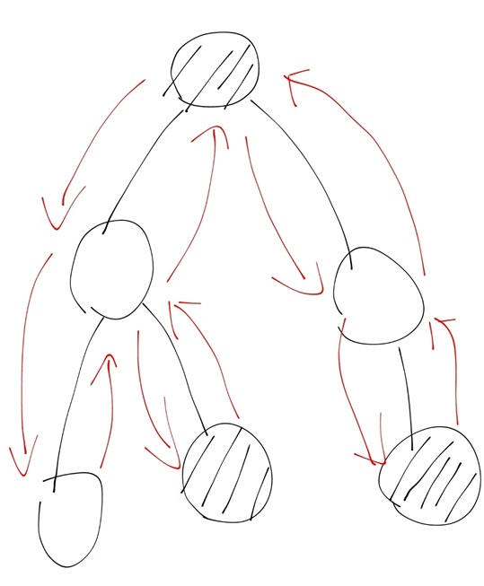

# 递推与递归

## 简述

$\qquad$ 一个实际问题的各种可能情况构成的集合通常称为`“状态空间”`，而程序的运行则是对状态空间的遍历，算法和数据结构通过划分、归纳、提取、抽象来帮助提高程序遍历状态空间的效率。`递推和递归`就是程序遍历状态空间的两种基本方式。

##

## 递推与递归的宏观描述

$\qquad$ 对于一个待求解的问题，当它局限在某处边界、某个小范围或者某种特殊情形下时，其答案往往是已知的。如果能够将该解答的应用场景扩大到原问题的状态空间，并且扩展过程的每个步骤具有相似性，就可以考虑使用递推或者递归求解。

$\qquad$ 以最简单的计算阶乘为例：求 $n!$ ，即 $1$ $\ast$ $2$ $\ast$ $3$ $\ast$ $\cdots$ $\ast$ $n$ ，特别地，定义 $0!$ $=$ $1$ 。

$\qquad$ 该问题的“边界”是 $0!$ $=$ $1$ 。从 $0!$ 计算到 $n!$ 共有 $n$ 步，其中第 $i$ 步需要在当前结果的基础上乘上 $i$ ，即每一步都具有相似性。在不考虑数据范围的情况下，我们很容易推写出以下代码：

```cpp
factorial[0] = 1;
for(int i = 1; i <= n; i ++ )
    factorial[i] = factorial[i-1] * i;
```

$\qquad$ 换一种思路，我们也可以定义函数 $factorial(n)$ 表示求出 $n!$ 的值，然后考虑如何实现该函数的计算。容易发现 $factorial(n)$ $=$ $factorial(n-1)$ $\ast$ $n$ ，进而写出下面的代码：

```cpp
int factorial(int n){
    if(n == 0) return 1;
    return factorial(n-1) * n;
}
```

$\qquad$ 像第一份代码那样，以已知的 “边界问题” 为起点向 “原问题” 正向推导的扩展方式就是递推。像第二份代码那样，函数自身定义自身，通过函数体实现循环，以自相似的方法重复进行的过程就被称为递归。

$\qquad$ 在由 “问题边界” 到 “原问题” 的推导路线明确时，我们可以使用递推来解决问题。然而在很多时候，推导的路线难以确定，这时候就需要使用递归，以 “原问题” 为起点尝试寻找把状态空间缩小到已知的 “问题边界” 的路线，再通过该路线反向回溯。

